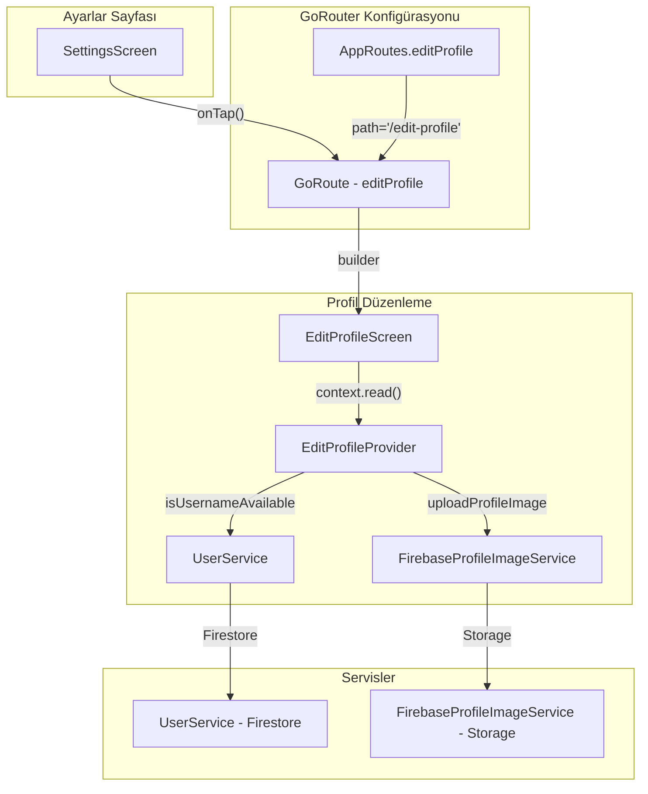

# Profil Düzenleme Özelliği - Implementasyon Planı

## Mevcut Durum Analizi

### 1. Mevcut Dosyalar
| Dosya | Durum | Satır |
|-------|-------|-------|
| [`lib/screens/profile/edit_profile_screen.dart`](lib/screens/profile/edit_profile_screen.dart) | ✅ UI hazır, navigasyon eksik | 1022 |
| [`lib/providers/edit_profile_provider.dart`](lib/providers/edit_profile_provider.dart) | ✅ State management hazır | 323 |
| [`lib/screens/settings/settings_screen.dart`](lib/screens/settings/settings_screen.dart) | ⚠️ onTap boş | 57-64 |
| [`lib/core/router/go_router_config.dart`](lib/core/router/go_router_config.dart) | ❌ Route yok | - |
| [`lib/main.dart`](lib/main.dart) | ❌ Provider kayıtlı değil | - |

### 2. Eksiklikler
- `AppRoutes` sınıfında `editProfile` route sabiti yok
- GoRouter'da edit-profile route tanımı yok
- `SettingsScreen`'de navigasyon callback'i yok
- `EditProfileProvider` main.dart'da kayıtlı değil
- `edit_profile_screen.dart` state olarak EditProfileProvider'a erişemiyor

---

## Implementasyon Adımları

### Adım 1: Route Sabitleri Ekle
**Dosya:** [`lib/core/router/go_router_config.dart`](lib/core/router/go_router_config.dart:37)

`AppRoutes` sınıfına yeni route sabiti ekle:
```dart
/// Profil düzenleme sayfası
static const editProfile = '/edit-profile';
```

### Adım 2: GoRouter'a Route Ekle
**Dosya:** [`lib/core/router/go_router_config.dart`](lib/core/router/go_router_config.dart:375)

Yeni route tanımı ekle — mevcut routes listesine:
```dart
// Edit Profile — profil düzenleme sayfası
GoRoute(
  path: AppRoutes.editProfile,
  name: 'editProfile',
  builder: (context, state) => const EditProfileScreen(),
),
```

### Adım 3: EditProfileProvider'ı Kaydet
**Dosya:** [`lib/main.dart`](lib/main.dart:45)

`MultiProvider` içine yeni provider ekle:
```dart
ChangeNotifierProvider<EditProfileProvider>(
  create: (_) => EditProfileProvider(
    userService: UserService(),
    imageService: FirebaseProfileImageService(),
  ),
),
```

### Adım 4: SettingsScreen'de Navigasyon Ekle
**Dosya:** [`lib/screens/settings/settings_screen.dart`](lib/screens/settings/settings_screen.dart:60)

Boş `onTap` callback'ini doldur:
```dart
NavigationTile(
  icon: Icons.person_outline,
  title: 'Profili Düzenle',
  onTap: () {
    Navigator.of(context).push(
      MaterialPageRoute(
        builder: (context) => const EditProfileScreen(),
      ),
    );
  },
  isFirst: true,
),
```

### Adım 5: EditProfileScreen'i GoRouter Navigation'a Dönüştür (Opsiyonel)
**Dosya:** [`lib/screens/profile/edit_profile_screen.dart`](lib/screens/profile/edit_profile_screen.dart:60)

MaterialPageRoute yerine GoRouter kullanmak için:
```dart
onTap: () {
  context.push(AppRoutes.editProfile);
},
```

---

## Mimari Şema



---

## Değiştirilecek Dosyalar Summary

| # | Dosya | İşlem | Öncelik |
|---|-------|-------|---------|
| 1 | [`lib/core/router/go_router_config.dart`](lib/core/router/go_router_config.dart) | AppRoutes.editProfile + GoRoute tanımı | 🔴 Yüksek |
| 2 | [`lib/main.dart`](lib/main.dart) | EditProfileProvider kaydı | 🔴 Yüksek |
| 3 | [`lib/screens/settings/settings_screen.dart`](lib/screens/settings/settings_screen.dart) | onTap navigasyonu | 🔴 Yüksek |
| 4 | [`lib/screens/profile/edit_profile_screen.dart`](lib/screens/profile/edit_profile_screen.dart) | GoRouter'a geçiş (opsiyonel) | 🟡 Orta |

---

## Test Senaryoları

1. **Ayarlardan profili düzenle'ye tıklama** → EditProfileScreen açılmalı
2. **Kullanıcı adı değişikliği** → Debounce ile uniqueness kontrol edilmeli
3. **Fotoğraf seçimi** → Kamera ve galeri seçenekleri çalışmalı
4. **Kaydetme** → Firestore güncellenmeli, UI optimistically update edilmeli
5. **Hata durumu** → Error message gösterilmeli

---

## Notlar

- `EditProfileProvider` constructor parametreleri: `UserService` ve `FirebaseProfileImageService`
- `edit_profile_screen.dart` zaten Provider kullanıyor, sadece kayıt eksik
- Mevcut UI tasarımı 1022 satır — değiştirilmeyecek, sadece navigation eklenecek