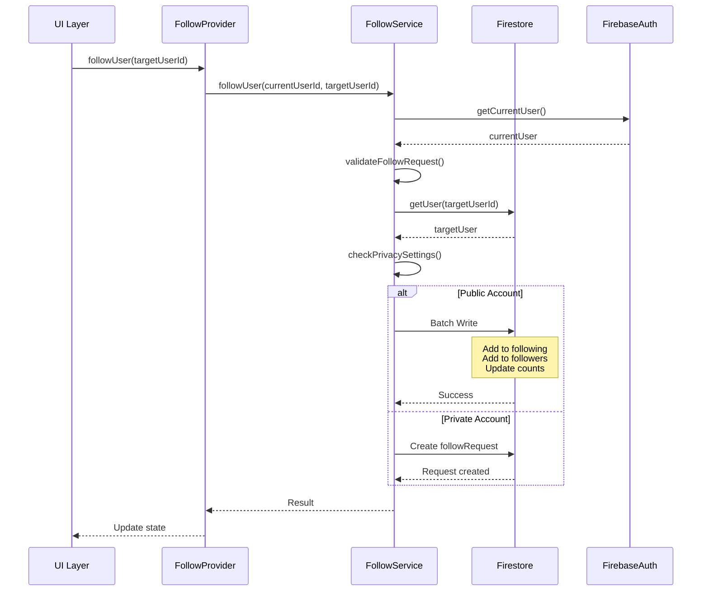
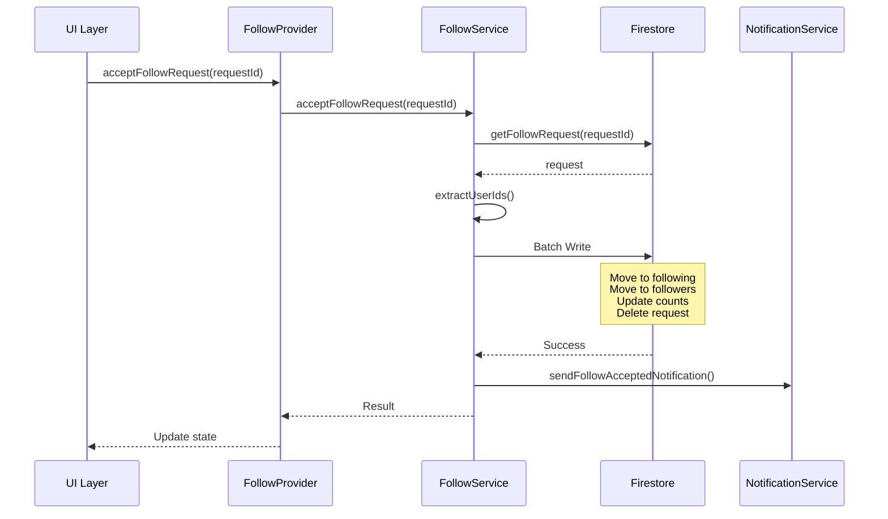
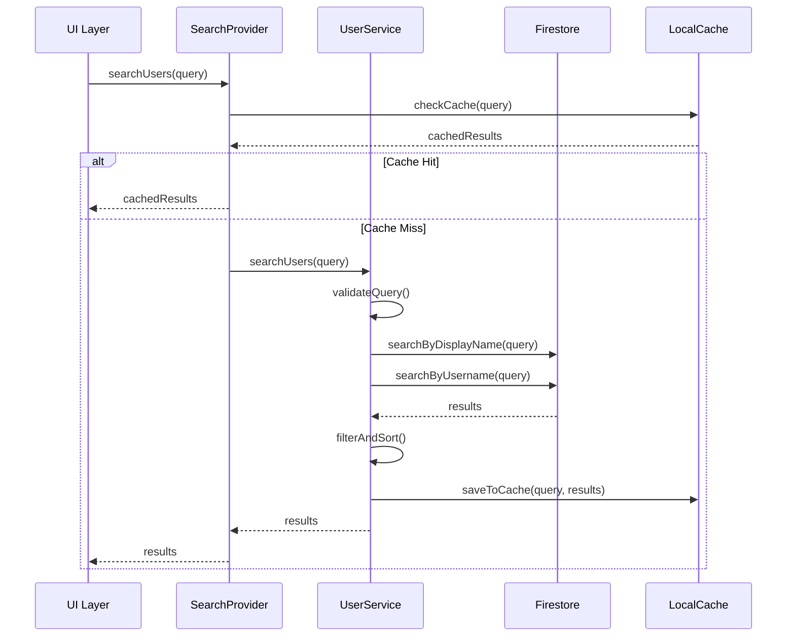
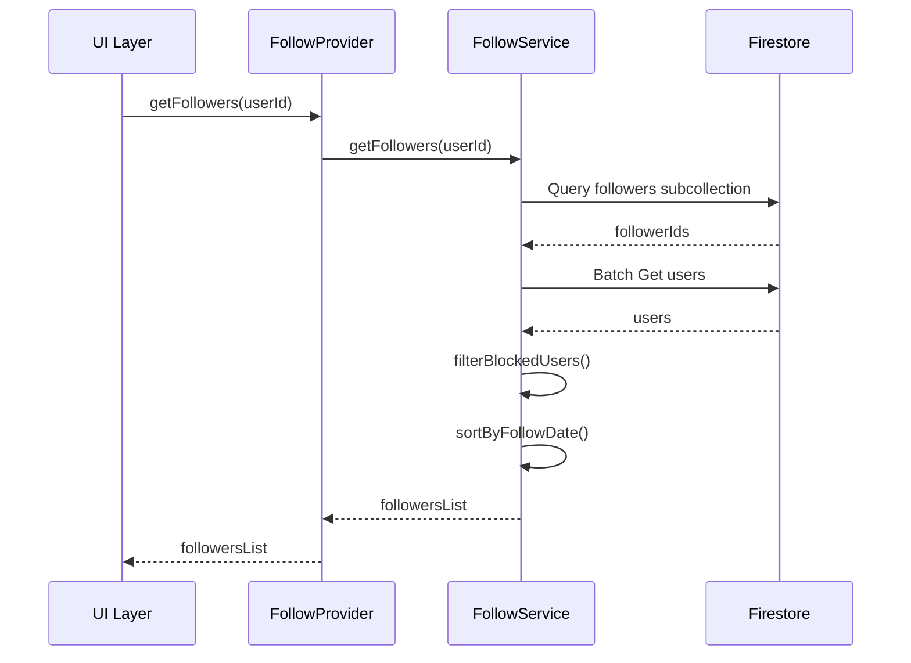

# Yio Takip Sistemi Mimari Tasarım Raporu

## Özet

Bu rapor, Yio sosyal pişirme platformu için kapsamlı bir takip ve takipçi bulma sistemi mimarisini detaylandırmaktadır. Sistem, kullanıcıların birbirini bulmasını, takip etmesini, takip isteklerini yönetmesini ve özel hesap özelliklerini desteklemek için tasarlanmıştır.

---

## 1. Veritabanı Şeması (Firestore Collections)

### 1.1 Ana Koleksiyon Yapısı

```
users (koleksiyon)
├── {userId} (doküman)
│   ├── uid: string
│   ├── email: string
│   ├── name: string
│   ├── username: string (unique)
│   ├── photoUrl: string?
│   ├── bio: string?
│   ├── interests: string[]
│   ├── role: string
│   ├── onboardingCompleted: boolean
│   ├── createdAt: timestamp
│   ├── level: int
│   ├── recipeCount: int
│   ├── followersCount: int
│   ├── followingCount: int
│   ├── isPrivate: boolean
│   ├── followRequestApproval: boolean
│   └── lastActiveAt: timestamp
│
├── following (subcollection)
│   └── {targetUserId} (doküman)
│       ├── userId: string
│       ├── followedAt: timestamp
│       └── status: string (accepted, pending)
│
├── followers (subcollection)
│   └── {followerUserId} (doküman)
│       ├── userId: string
│       ├── followedAt: timestamp
│       └── status: string (accepted, pending)
│
└── followRequests (subcollection)
    └── {requestId} (doküman)
        ├── requesterId: string
        ├── requesterName: string
        ├── requesterPhotoUrl: string?
        ├── requestedAt: timestamp
        └── status: string (pending, accepted, rejected)
```

### 1.2 Koleksiyon Detayları

#### users Koleksiyonu

| Alan | Tip | Açıklama | Zorunlu |
|------|-----|----------|---------|
| uid | string | Firebase Authentication kullanıcı ID | Evet |
| email | string | Kullanıcı e-posta adresi | Evet |
| name | string | Kullanıcı adı soyadı | Evet |
| username | string | Benzersiz kullanıcı adı | Evet |
| photoUrl | string? | Profil fotoğrafı URL | Hayır |
| bio | string? | Kullanıcı biyografisi | Hayır |
| interests | string[] | İlgi alanları listesi | Hayır |
| role | string | Kullanıcı rolü (user/admin) | Evet |
| onboardingCompleted | boolean | Onboarding tamamlanma durumu | Evet |
| createdAt | timestamp | Hesap oluşturma tarihi | Evet |
| level | int | Kullanıcı seviyesi (1-5) | Evet |
| recipeCount | int | Tarif sayısı | Evet |
| followersCount | int | Takipçi sayısı | Evet |
| followingCount | int | Takip edilen sayısı | Evet |
| isPrivate | boolean | Özel hesap durumu | Evet |
| followRequestApproval | boolean | Takip isteği onayı | Evet |
| lastActiveAt | timestamp | Son aktivite zamanı | Evet |

#### following Subcollection

Kullanıcının takip ettiği kişileri tutar.

| Alan | Tip | Açıklama |
|------|-----|----------|
| userId | string | Takip edilen kullanıcı ID |
| followedAt | timestamp | Takip başlangıç zamanı |
| status | string | Durum (accepted, pending) |

#### followers Subcollection

Kullanıcıyı takip edenleri tutar.

| Alan | Tip | Açıklama |
|------|-----|----------|
| userId | string | Takipçi kullanıcı ID |
| followedAt | timestamp | Takip başlangıç zamanı |
| status | string | Durum (accepted, pending) |

#### followRequests Subcollection

Gelen takip isteklerini tutar.

| Alan | Tip | Açıklama |
|------|-----|----------|
| requesterId | string | İstek gönderen kullanıcı ID |
| requesterName | string | İstek gönderen adı |
| requesterPhotoUrl | string? | İstek gönderen fotoğrafı |
| requestedAt | timestamp | İstek zamanı |
| status | string | Durum (pending, accepted, rejected) |

### 1.3 İndeksler

Firestore sorguları için gerekli indeksler:

```javascript
// users koleksiyonu için
- displayName (asc)
- username (asc, unique)
- createdAt (desc)

// following subcollection için
- followedAt (desc)

// followers subcollection için
- followedAt (desc)

// followRequests subcollection için
- requestedAt (desc)
- status (asc)
```

---

## 2. Data Flow Diyagramları

### 2.1 Takip İşlemi Data Flow



### 2.2 Takip İsteği Onayı Data Flow



### 2.3 Kullanıcı Arama Data Flow



### 2.4 Takipçi/Takip Edilen Listesi Data Flow



---

## 3. Screen ve Component Yapısı

### 3.1 Screen Hiyerarşisi

```
lib/screens/
├── search/
│   ├── search_screen.dart              # Ana arama ekranı
│   └── search_results_screen.dart     # Arama sonuçları ekranı
│
├── profile/
│   ├── profile_screen.dart            # Mevcut profil ekranı
│   ├── other_profile_screen.dart      # Başka kullanıcının profili
│   ├── followers_screen.dart          # Takipçiler ekranı
│   ├── following_screen.dart         # Takip edilenler ekranı
│   └── follow_requests_screen.dart   # Takip istekleri ekranı
│
└── widgets/
    ├── user_search_bar.dart           # Kullanıcı arama çubuğu
    ├── user_list_item.dart            # Kullanıcı listesi öğesi
    ├── follow_button.dart             # Takip butonu
    ├── follower_item.dart             # Takipçi öğesi
    ├── follow_request_item.dart        # Takip isteği öğesi
    └── empty_state_widget.dart        # Boş durum widget'ı
```

### 3.2 Screen Detayları

#### SearchScreen

**Konum:** `lib/screens/search/search_screen.dart`

**Sorumluluklar:**
- Kullanıcı arama arayüzünü sağlar
- Arama sonuçlarını listeler
- Son aramaları gösterir
- Önerilen kullanıcıları gösterir

**State:**
```dart
class SearchScreenState {
  String searchQuery;
  List<UserModel> searchResults;
  List<UserModel> recentSearches;
  List<UserModel> suggestedUsers;
  bool isSearching;
  bool hasResults;
}
```

**Widget Yapısı:**
```dart
SearchScreen
├── AppBar
│   └── SearchTextField
├── RecentSearchesSection
│   └── RecentSearchChips
├── SuggestedUsersSection
│   └── UserListItem (horizontal scroll)
└── SearchResultsSection
    └── UserListItem (vertical list)
```

#### OtherProfileScreen

**Konum:** `lib/screens/profile/other_profile_screen.dart`

**Sorumluluklar:**
- Başka kullanıcının profilini gösterir
- Takip/takip etme butonunu yönetir
- Özel hesap kontrolü yapar
- Kullanıcı tariflerini listeler

**State:**
```dart
class OtherProfileScreenState {
  String userId;
  UserModel? user;
  bool isFollowing;
  bool isPrivate;
  bool canViewContent;
  List<RecipeModel> recipes;
  int followersCount;
  int followingCount;
}
```

**Widget Yapısı:**
```dart
OtherProfileScreen
├── AppBar
│   ├── BackButton
│   └── MoreOptionsButton
├── ProfileHeader
│   ├── Avatar
│   ├── Name
│   ├── Username
│   ├── Bio
│   └── FollowButton
├── StatsRow
│   ├── FollowersCount
│   ├── FollowingCount
│   └── RecipesCount
└── ContentArea
    ├── PrivateAccountMessage (if private)
    └── RecipesGrid
```

#### FollowersScreen

**Konum:** `lib/screens/profile/followers_screen.dart`

**Sorumluluklar:**
- Takipçi listesini gösterir
- Takipçileri arama ve filtreleme sağlar
- Takipçileri takip etme/etmeme işlemleri

**State:**
```dart
class FollowersScreenState {
  String userId;
  List<UserModel> followers;
  String filterQuery;
  bool isLoading;
  bool hasMore;
}
```

#### FollowingScreen

**Konum:** `lib/screens/profile/following_screen.dart`

**Sorumluluklar:**
- Takip edilen listesini gösterir
- Takip edilenleri arama ve filtreleme sağlar
- Takip etmeyi bırakma işlemleri

**State:**
```dart
class FollowingScreenState {
  String userId;
  List<UserModel> following;
  String filterQuery;
  bool isLoading;
  bool hasMore;
}
```

#### FollowRequestsScreen

**Konum:** `lib/screens/profile/follow_requests_screen.dart`

**Sorumluluklar:**
- Bekleyen takip isteklerini listeler
- İstekleri kabul etme/reddetme işlemleri
- İstek detaylarını gösterir

**State:**
```dart
class FollowRequestsScreenState {
  List<FollowRequest> requests;
  bool isLoading;
  int pendingCount;
}
```

### 3.3 Component Detayları

#### UserSearchBar

**Konum:** `lib/screens/search/widgets/user_search_bar.dart`

**Özellikler:**
- Debounce ile arama
- Temizleme butonu
- Odaklanma animasyonları
- Son aramaları öneri olarak gösterme

#### UserListItem

**Konum:** `lib/screens/search/widgets/user_list_item.dart`

**Özellikler:**
- Kullanıcı avatarı
- Kullanıcı adı ve kullanıcı adı handle
- Takip durumu göstergesi
- Takip butonu
- Swipe-to-follow gesture

#### FollowButton

**Konum:** `lib/screens/profile/widgets/follow_button.dart`

**Durumlar:**
- Not Following (Takip Et)
- Following (Takip Ediliyor)
- Pending (İstek Gönderildi)
- Private (Özel Hesap)

**Animasyonlar:**
- Durum değişiminde smooth transition
- Loading state
- Success/error feedback

#### FollowerItem

**Konum:** `lib/screens/profile/widgets/follower_item.dart`

**Özellikler:**
- Takipçi bilgisi
- Takip etme butonu
- Takip tarihi
- Mutual followers göstergesi

#### FollowRequestItem

**Konum:** `lib/screens/profile/widgets/follow_request_item.dart`

**Özellikler:**
- İstek gönderen bilgisi
- Kabul et butonu
- Reddet butonu
- İstek zamanı

---

## 4. Provider ve State Management Mimarisi

### 4.1 Provider Hiyerarşisi

```
lib/providers/
├── follow_provider.dart              # Ana takip provider
├── search_provider.dart              # Arama provider
├── user_list_provider.dart           # Kullanıcı listesi provider
└── follow_request_provider.dart      # Takip isteği provider
```

### 4.2 FollowProvider

**Konum:** `lib/providers/follow_provider.dart`

**Sorumluluklar:**
- Takip/takip etmeme işlemlerini yönetir
- Takip durumunu takip eder
- Takipçi/takip edilen listelerini yönetir
- Özel hesap kontrollerini yapar

**State:**
```dart
class FollowProvider extends ChangeNotifier {
  // Current user state
  String? currentUserId;
  Set<String> followingIds;
  Set<String> followerIds;
  Map<String, FollowStatus> followStatusMap;
  
  // Target user state
  String? targetUserId;
  FollowStatus? targetFollowStatus;
  
  // Lists
  List<UserModel> followers;
  List<UserModel> following;
  
  // Loading states
  bool isLoadingFollowers;
  bool isLoadingFollowing;
  bool isFollowing;
  bool isUnfollowing;
  
  // Error states
  String? errorMessage;
}
```

**Metotlar:**
```dart
// Takip işlemleri
Future<bool> followUser(String targetUserId);
Future<bool> unfollowUser(String targetUserId);
Future<bool> cancelFollowRequest(String targetUserId);

// Durum sorgulama
Future<FollowStatus> getFollowStatus(String targetUserId);
Stream<FollowStatus> followStatusStream(String targetUserId);
bool isFollowingUser(String userId);

// Listeler
Future<void> loadFollowers(String userId, {int limit});
Future<void> loadFollowing(String userId, {int limit});
Stream<List<UserModel>> followersStream(String userId);
Stream<List<UserModel>> followingStream(String userId);

// İstekler
Future<void> loadFollowRequests();
Future<bool> acceptFollowRequest(String requestId);
Future<bool> rejectFollowRequest(String requestId);
Stream<List<FollowRequest>> followRequestsStream();

// Sayılar
Stream<int> followersCountStream(String userId);
Stream<int> followingCountStream(String userId);
```

### 4.3 SearchProvider

**Konum:** `lib/providers/search_provider.dart`

**Sorumluluklar:**
- Kullanıcı arama işlemlerini yönetir
- Arama sonuçlarını önbelleğe alır
- Son aramaları tutar
- Önerilen kullanıcıları yönetir

**State:**
```dart
class SearchProvider extends ChangeNotifier {
  // Search state
  String currentQuery;
  List<UserModel> searchResults;
  bool isSearching;
  bool hasResults;
  
  // Recent searches
  List<UserModel> recentSearches;
  List<String> recentQueries;
  
  // Suggestions
  List<UserModel> suggestedUsers;
  
  // Cache
  Map<String, List<UserModel>> searchCache;
  DateTime? lastCacheClear;
  
  // Error
  String? errorMessage;
}
```

**Metotlar:**
```dart
// Arama
Future<void> searchUsers(String query);
Future<void> searchByUsername(String username);
Future<void> searchByDisplayName(String displayName);

// Önbellek
void clearSearchCache();
void saveToCache(String query, List<UserModel> results);
List<UserModel>? getFromCache(String query);

// Son aramalar
void addToRecentSearches(UserModel user);
void addToRecentQueries(String query);
void clearRecentSearches();
void clearRecentQueries();

// Öneriler
Future<void> loadSuggestedUsers();
Future<void> loadTrendingUsers();
```

### 4.4 UserListProvider

**Konum:** `lib/providers/user_list_provider.dart`

**Sorumluluklar:**
- Kullanıcı listelerini yönetir
- Pagination (sayfalama) yapar
- Filtreleme ve sıralama sağlar
- Infinite scroll destekler

**State:**
```dart
class UserListProvider extends ChangeNotifier {
  // List state
  List<UserModel> users;
  bool hasMore;
  DocumentSnapshot? lastDocument;
  int currentPage;
  int pageSize;
  
  // Filter state
  String? filterQuery;
  UserSortOption sortBy;
  UserFilterOption filterBy;
  
  // Loading
  bool isLoading;
  bool isLoadingMore;
  
  // Error
  String? errorMessage;
}
```

**Metotlar:**
```dart
// List yükleme
Future<void> loadUsers({bool refresh = false});
Future<void> loadMoreUsers();
void refreshUsers();

// Filtreleme
void setFilterQuery(String query);
void setSortBy(UserSortOption option);
void setFilterBy(UserFilterOption option);
void clearFilters();

// Pagination
bool get canLoadMore;
void resetPagination();
```

### 4.5 FollowRequestProvider

**Konum:** `lib/providers/follow_request_provider.dart`

**Sorumluluklar:**
- Takip isteklerini yönetir
- İstekleri kabul/reddetme işlemlerini yapar
- İstek bildirimlerini yönetir

**State:**
```dart
class FollowRequestProvider extends ChangeNotifier {
  // Requests
  List<FollowRequest> pendingRequests;
  List<FollowRequest> acceptedRequests;
  List<FollowRequest> rejectedRequests;
  
  // Counts
  int pendingCount;
  int totalCount;
  
  // Loading
  bool isLoading;
  bool isProcessing;
  
  // Error
  String? errorMessage;
}
```

**Metotlar:**
```dart
// İstek yükleme
Future<void> loadPendingRequests();
Future<void> loadAllRequests();
Stream<List<FollowRequest>> pendingRequestsStream();

// İstek işlemleri
Future<bool> acceptRequest(String requestId);
Future<bool> rejectRequest(String requestId);
Future<bool> acceptAllRequests();
Future<bool> rejectAllRequests();

// Bildirimler
Future<void> markAsRead(String requestId);
Future<void> markAllAsRead();
```

### 4.6 Provider Entegrasyonu

```dart
// main.dart
MultiProvider(
  providers: [
    // Mevcut providers
    ChangeNotifierProvider(create: (_) => AuthProvider()),
    ChangeNotifierProvider(create: (_) => ThemeProvider()),
    ChangeNotifierProvider(create: (_) => SettingsProvider()),
    
    // Yeni follow system providers
    ChangeNotifierProvider(create: (_) => FollowProvider()),
    ChangeNotifierProvider(create: (_) => SearchProvider()),
    ChangeNotifierProvider(create: (_) => UserListProvider()),
    ChangeNotifierProvider(create: (_) => FollowRequestProvider()),
  ],
  child: MyApp(),
)
```

---

## 5. API Endpoints ve Metotları

### 5.1 Service Katmanı Yapısı

```
lib/services/
├── follow_service.dart               # Ana takip servisi
├── user_search_service.dart          # Kullanıcı arama servisi
└── follow_request_service.dart      # Takip isteği servisi
```

### 5.2 FollowService

**Konum:** `lib/services/follow_service.dart`

**Temel Metotlar:**

```dart
class FollowService {
  /// Kullanıcıyı takip et
  Future<FollowResult> followUser(String targetUserId);

  /// Takibi bırak
  Future<FollowResult> unfollowUser(String targetUserId);

  /// Takip isteğini iptal et
  Future<FollowResult> cancelFollowRequest(String targetUserId);

  /// Takip durumunu kontrol et
  Future<FollowStatus> getFollowStatus(String targetUserId);

  /// Takipçi listesini getir
  Future<List<UserModel>> getFollowers(String userId, {int limit, DocumentSnapshot? startAfter});

  /// Takip edilen listesini getir
  Future<List<UserModel>> getFollowing(String userId, {int limit, DocumentSnapshot? startAfter});

  /// Takipçi sayısı stream
  Stream<int> followersCountStream(String userId);

  /// Takip edilen sayısı stream
  Stream<int> followingCountStream(String userId);
}

enum FollowStatus {
  notFollowing,
  following,
  pending,
  requested,
}
```

### 5.3 UserSearchService

**Konum:** `lib/services/user_search_service.dart`

**Temel Metotlar:**

```dart
class UserSearchService {
  /// Kullanıcıları ada göre ara
  Future<List<UserModel>> searchByDisplayName(String query, {int limit = 20});

  /// Kullanıcıları kullanıcı adına göre ara
  Future<UserModel?> searchByUsername(String username);

  /// Kullanıcıları e-posta ile ara
  Future<UserModel?> searchByEmail(String email);

  /// Genel arama (displayName + username)
  Future<List<UserModel>> searchUsers(String query, {int limit = 20});

  /// Önerilen kullanıcıları getir
  Future<List<UserModel>> getSuggestedUsers({int limit = 10});

  /// Trend kullanıcıları getir
  Future<List<UserModel>> getTrendingUsers({int limit = 10});
}
```

### 5.4 FollowRequestService

**Konum:** `lib/services/follow_request_service.dart`

**Temel Metotlar:**

```dart
class FollowRequestService {
  /// Takip isteği gönder
  Future<bool> sendFollowRequest(String targetUserId);

  /// Takip isteğini kabul et
  Future<bool> acceptFollowRequest(String requesterId);

  /// Takip isteğini reddet
  Future<bool> rejectFollowRequest(String requesterId);

  /// Bekleyen istekleri getir
  Future<List<FollowRequest>> getPendingRequests();

  /// Bekleyen istekler stream
  Stream<List<FollowRequest>> pendingRequestsStream();

  /// İstek sayısı stream
  Stream<int> pendingCountStream();
}
```

---

## 6. Güvenlik ve Validasyon

### 6.1 Client-Side Validasyon

#### Kullanıcı Arama Validasyonu

```dart
class SearchValidator {
  static const int minSearchLength = 2;
  static const int maxSearchLength = 30;

  static String? validateQuery(String query) {
    if (query.isEmpty) {
      return 'Arama sorgusu boş olamaz';
    }
    if (query.length < minSearchLength) {
      return 'Arama sorgusu en az $minSearchLength karakter olmalı';
    }
    if (query.length > maxSearchLength) {
      return 'Arama sorgusu çok uzun';
    }
    if (!RegExp(r'^[a-zA-Z0-9ğüşıöçĞÜŞİÖÇ@._\s-]+$').hasMatch(query)) {
      return 'Geçersiz karakterler içeriyor';
    }
    return null;
  }
}
```

#### Takip İşlemi Validasyonu

```dart
class FollowValidator {
  static String? validateFollowRequest(String currentUserId, String targetUserId) {
    // Kendini takip etme kontrolü
    if (currentUserId == targetUserId) {
      return 'Kendinizi takip edemezsiniz';
    }

    // Kullanıcı ID formatı kontrolü
    if (!RegExp(r'^[a-zA-Z0-9_-]+$').hasMatch(targetUserId)) {
      return 'Geçersiz kullanıcı ID';
    }

    return null;
  }

  static Future<bool> canFollowUser(String currentUserId, String targetUserId) async {
    // Rate limiting kontrolü
    final recentFollows = await getRecentFollowCount(currentUserId, Duration(minutes: 10));
    if (recentFollows >= 50) {
      throw Exception('Çok fazla takip işlemi. Lütfen bekleyin.');
    }

    return true;
  }
}
```

### 6.2 Server-Side Güvenlik (Firestore Security Rules)

```javascript
rules_version = '2';
service cloud.firestore {
  match /databases/{database}/documents {

    // Helper functions
    function isAuthenticated() {
      return request.auth != null;
    }
    
    function isOwner(userId) {
      return isAuthenticated() && request.auth.uid == userId;
    }
    
    function isPublicAccount(userId) {
      return get(/databases/$(database)/documents/users/$(userId)).data.isPrivate == false;
    }

    // Users collection
    match /users/{userId} {
      // Okuma: Herkes okuyabilir (public profiller için)
      allow read: if isAuthenticated();
      
      // Yazma: Sadece sahip
      allow write: if isOwner(userId);
      
      // Following subcollection
      match /following/{targetUserId} {
        // Okuma: Sadece sahip
        allow read: if isOwner(userId);
        
        // Oluşturma: Sadece sahip, ve hedef kullanıcı public ise
        allow create: if isOwner(userId) 
                      && isPublicAccount(targetUserId);
        
        // Silme: Sadece sahip
        allow delete: if isOwner(userId);
      }
      
      // Followers subcollection
      match /followers/{followerUserId} {
        // Okuma: Sadece sahip
        allow read: if isOwner(userId);
        
        // Yazma: Sadece takipçi kendisi yazabilir (servis tarafında)
        allow write: if false; // Sadece Cloud Functions ile
      }
      
      // FollowRequests subcollection
      match /followRequests/{requesterId} {
        // Okuma: Sadece sahip
        allow read: if isOwner(userId);
        
        // Oluşturma: Herkes istek gönderebilir
        allow create: if isAuthenticated() 
                      && request.auth.uid == requesterId
                      && isOwner(userId)
                      && get(/databases/$(database)/documents/users/$(userId)).data.isPrivate == true;
        
        // Güncelleme/Silme: Sadece sahip (kabul/reddetme için)
        allow update, delete: if isOwner(userId);
      }
    }
  }
}
```

### 6.3 Rate Limiting

```dart
class RateLimiter {
  final FirebaseFirestore _firestore;
  final String userId;

  /// Takip işlemi için rate limiting
  Future<bool> canPerformFollow() async {
    final doc = await _firestore
        .collection('rate_limits')
        .doc(userId)
        .get();

    if (!doc.exists) {
      await _initializeRateLimit();
      return true;
    }

    final data = doc.data()!;
    final lastFollowTime = (data['lastFollowTime'] as Timestamp).toDate();
    final followCount = data['followCount'] as int;

    // 10 dakika içinde 50 takip limiti
    if (DateTime.now().difference(lastFollowTime).inMinutes < 10) {
      if (followCount >= 50) {
        return false;
      }
    } else {
      // Reset counter
      await _resetFollowCount();
    }

    return true;
  }

  /// Takip işlemi sonrası counter güncelleme
  Future<void> recordFollow() async {
    await _firestore
        .collection('rate_limits')
        .doc(userId)
        .update({
      'lastFollowTime': FieldValue.serverTimestamp(),
      'followCount': FieldValue.increment(1),
    });
  }
}
```

### 6.4 Veri Sanitizasyonu

```dart
class DataSanitizer {
  /// Kullanıcı adını sanitize et
  static String sanitizeUsername(String username) {
    return username
        .trim()
        .toLowerCase()
        .replaceAll(RegExp(r'[^\w]'), '');
  }

  /// Arama sorgusunu sanitize et
  static String sanitizeSearchQuery(String query) {
    return query
        .trim()
        .replaceAll(RegExp(r'[<>\"\'%]'), '');
  }

  /// Kullanıcı verisini sanitize et
  static Map<String, dynamic> sanitizeUserData(Map<String, dynamic> data) {
    final sanitized = <String, dynamic>{};
    
    if (data['name'] is String) {
      sanitized['name'] = (data['name'] as String).trim();
    }
    
    if (data['bio'] is String) {
      sanitized['bio'] = (data['bio'] as String).trim().substring(0, 150);
    }
    
    return sanitized;
  }
}
```

---

## 7. Performans Optimizasyonları

### 7.1 Firestore Optimizasyonları

#### 7.1.1 Batch Write İşlemleri

```dart
// Tek bir batch ile birden fazla işlem
Future<void> followUserBatch(String currentUserId, String targetUserId) async {
  final batch = _firestore.batch();

  // Following'e ekle
  final followingRef = _firestore
      .collection('users')
      .doc(currentUserId)
      .collection('following')
      .doc(targetUserId);
  batch.set(followingRef, followData);

  // Followers'a ekle
  final followersRef = _firestore
      .collection('users')
      .doc(targetUserId)
      .collection('followers')
      .doc(currentUserId);
  batch.set(followersRef, followData);

  // Sayıları güncelle
  batch.update(_firestore.collection('users').doc(currentUserId), {
    'followingCount': FieldValue.increment(1),
  });
  batch.update(_firestore.collection('users').doc(targetUserId), {
    'followersCount': FieldValue.increment(1),
  });

  await batch.commit();
}
```

#### 7.1.2 Pagination (Sayfalama)

```dart
class PaginatedUserList {
  final int pageSize = 20;
  DocumentSnapshot? lastDocument;
  bool hasMore = true;

  Future<List<UserModel>> loadNextPage(String userId) async {
    if (!hasMore) return [];

    Query query = _firestore
        .collection('users')
        .doc(userId)
        .collection('followers')
        .orderBy('followedAt', descending: true)
        .limit(pageSize);

    if (lastDocument != null) {
      query = query.startAfterDocument(lastDocument!);
    }

    final snapshot = await query.get();

    if (snapshot.docs.isEmpty) {
      hasMore = false;
      return [];
    }

    lastDocument = snapshot.docs.last;
    hasMore = snapshot.docs.length == pageSize;

    return await _fetchUsers(snapshot);
  }
}
```

#### 7.1.3 Selective Field Loading

```dart
// Sadece gerekli alanları yükle
Future<List<UserModel>> loadUsersMinimal(List<String> userIds) async {
  final snapshots = await Future.wait(
    userIds.map((id) => _firestore
        .collection('users')
        .doc(id)
        .get(const GetOptions(
          source: Source.server,
        ))),
  );

  return snapshots
      .where((doc) => doc.exists)
      .map((doc) => UserModel.fromDocument(doc))
      .toList();
}
```

### 7.2 Client-Side Optimizasyonlar

#### 7.2.1 Local Caching

```dart
class UserCache {
  final Map<String, CachedUser> _cache = {};
  final Duration _cacheDuration = Duration(minutes: 5);

  Future<UserModel?> getUser(String userId) async {
    // Cache kontrolü
    if (_cache.containsKey(userId)) {
      final cached = _cache[userId]!;
      if (DateTime.now().difference(cached.cachedAt) < _cacheDuration) {
        return cached.user;
      }
    }

    // Firestore'dan getir
    final user = await _fetchUserFromFirestore(userId);
    if (user != null) {
      _cache[userId] = CachedUser(user: user, cachedAt: DateTime.now());
    }

    return user;
  }

  void clearCache() {
    _cache.clear();
  }
}

class CachedUser {
  final UserModel user;
  final DateTime cachedAt;
  CachedUser({required this.user, required this.cachedAt});
}
```

#### 7.2.2 Debounce

```dart
class DebouncedSearch {
  Timer? _debounce;
  final Duration delay;

  DebouncedSearch({this.delay = const Duration(milliseconds: 500)});

  void call(String query, Function(String) callback) {
    _debounce?.cancel();
    _debounce = Timer(delay, () => callback(query));
  }

  void dispose() {
    _debounce?.cancel();
  }
}
```

#### 7.2.3 Optimistic Updates

```dart
class OptimisticFollowProvider extends ChangeNotifier {
  Future<void> followUser(String targetUserId) async {
    // Optimistic update
    _followingIds.add(targetUserId);
    notifyListeners();

    try {
      await _followService.followUser(targetUserId);
    } catch (e) {
      // Rollback on error
      _followingIds.remove(targetUserId);
      notifyListeners();
      rethrow;
    }
  }
}
```

### 7.3 Memory Optimizasyonları

#### 7.3.1 Lazy Loading

```dart
class LazyUserList {
  final List<String> _userIds;
  final Map<String, UserModel> _loadedUsers = {};

  List<UserModel> getVisibleUsers(int startIndex, int count) {
    final visible = <UserModel>[];
    
    for (int i = startIndex; i < startIndex + count && i < _userIds.length; i++) {
      final userId = _userIds[i];
      
      if (!_loadedUsers.containsKey(userId)) {
        // Load user asynchronously
        _loadUserAsync(userId);
      }
      
      if (_loadedUsers.containsKey(userId)) {
        visible.add(_loadedUsers[userId]!);
      }
    }
    
    return visible;
  }

  void _loadUserAsync(String userId) async {
    final user = await _fetchUser(userId);
    if (user != null) {
      _loadedUsers[userId] = user;
      notifyListeners();
    }
  }
}
```

#### 7.3.2 Image Caching

```dart
class CachedNetworkImageBuilder extends StatelessWidget {
  final String imageUrl;
  final String placeholder;

  @override
  Widget build(BuildContext context) {
    return Image.network(
      imageUrl,
      loadingBuilder: (context, child, loadingProgress) {
        if (loadingProgress == null) return child;
        return _buildPlaceholder();
      },
      errorBuilder: (context, error, stackTrace) {
        return _buildErrorPlaceholder();
      },
      // Cache dimensions
      width: 100,
      height: 100,
      // Cache key
      cacheKey: imageUrl,
    );
  }
}
```

### 7.4 Network Optimizasyonları

#### 7.4.1 Request Batching

```dart
class BatchUserFetcher {
  /// Birden fazla kullanıcıyı tek seferde getir
  Future<List<UserModel>> fetchUsersBatch(List<String> userIds) async {
    final chunks = _chunkList(userIds, 10);
    final results = <UserModel>[];

    for (final chunk in chunks) {
      final futures = chunk.map((id) => _fetchUser(id));
      final chunkResults = await Future.wait(futures);
      results.addAll(chunkResults.whereType<UserModel>());
    }

    return results;
  }

  List<List<T>> _chunkList<T>(List<T> list, int chunkSize) {
    final chunks = <List<T>>[];
    for (int i = 0; i < list.length; i += chunkSize) {
      chunks.add(list.sublist(i, min(i + chunkSize, list.length)));
    }
    return chunks;
  }
}
```

#### 7.4.2 Offline Support

```dart
class OfflineFollowService {
  final FirebaseFirestore _firestore;

  Future<void> enableOffline() async {
    await _firestore.settings = const Settings(
      persistenceEnabled: true,
      cacheSizeBytes: Settings.CACHE_SIZE_UNLIMITED,
    );
  }

  /// Offline modda takip et
  Future<void> followUserOffline(String targetUserId) async {
    await _firestore
        .collection('users')
        .doc(_getCurrentUserId())
        .collection('following')
        .doc(targetUserId)
        .set({
      'userId': targetUserId,
      'followedAt': Timestamp.now(),
      'status': 'pending_sync',
    });

    _syncFollowWhenOnline(targetUserId);
  }
}
```

### 7.5 UI Performans Optimizasyonları

#### 7.5.1 ListView Builder

```dart
class OptimizedUserList extends StatelessWidget {
  final List<UserModel> users;

  @override
  Widget build(BuildContext context) {
    return ListView.builder(
      itemCount: users.length,
      itemExtent: 80,
      addAutomaticKeepAlives: true,
      itemBuilder: (context, index) {
        return RepaintBoundary(
          child: UserListItem(user: users[index]),
        );
      },
    );
  }
}
```

---

## 8. Model Tanımları

### 8.1 FollowRequest Model

```dart
class FollowRequest {
  final String requestId;
  final String requesterId;
  final String requesterName;
  final String? requesterPhotoUrl;
  final DateTime requestedAt;
  final FollowRequestStatus status;

  FollowRequest({
    required this.requestId,
    required this.requesterId,
    required this.requesterName,
    this.requesterPhotoUrl,
    required this.requestedAt,
    required this.status,
  });

  factory FollowRequest.fromJson(Map<String, dynamic> json) {
    return FollowRequest(
      requestId: json['requestId'] as String,
      requesterId: json['requesterId'] as String,
      requesterName: json['requesterName'] as String,
      requesterPhotoUrl: json['requesterPhotoUrl'] as String?,
      requestedAt: (json['requestedAt'] as Timestamp).toDate(),
      status: FollowRequestStatus.values.firstWhere(
        (e) => e.toString() == 'FollowRequestStatus.${json['status']}',
        orElse: () => FollowRequestStatus.pending,
      ),
    );
  }

  Map<String, dynamic> toJson() {
    return {
      'requestId': requestId,
      'requesterId': requesterId,
      'requesterName': requesterName,
      'requesterPhotoUrl': requesterPhotoUrl,
      'requestedAt': Timestamp.fromDate(requestedAt),
      'status': status.toString().split('.').last,
    };
  }
}

enum FollowRequestStatus {
  pending,
  accepted,
  rejected,
}
```

### 8.2 FollowStatus Enum

```dart
enum FollowStatus {
  notFollowing,
  following,
  pending,
  requested,
}

extension FollowStatusExtension on FollowStatus {
  String get label {
    switch (this) {
      case FollowStatus.notFollowing:
        return 'Takip Et';
      case FollowStatus.following:
        return 'Takip Ediliyor';
      case FollowStatus.pending:
        return 'İstek Gönderildi';
      case FollowStatus.requested:
        return 'İstek Bekleniyor';
    }
  }

  bool get isFollowing => this == FollowStatus.following;
  bool get isPending => this == FollowStatus.pending || this == FollowStatus.requested;
  bool get canFollow => this == FollowStatus.notFollowing;
}
```

---

## 9. Constants

### 9.1 Follow Constants

```dart
class FollowConstants {
  FollowConstants._();

  static const int maxFollowsPerDay = 100;
  static const int maxFollowsPerHour = 20;
  static const int maxFollowRequestsPerDay = 50;
  static const int defaultPageSize = 20;
  static const int maxPageSize = 50;
  static const Duration userCacheDuration = Duration(minutes: 5);
  static const Duration searchCacheDuration = Duration(minutes: 10);
  static const Duration searchDebounceDelay = Duration(milliseconds: 500);
  static const int minSearchLength = 2;
  static const int maxSearchLength = 30;
  static const int maxSearchResults = 50;
  static const int suggestedUsersCount = 10;
}
```

---

## 10. Implementasyon Planı

### 10.1 Faz 1: Temel Altyapı

- [ ] Firestore şemasını oluştur
- [ ] Security rules'ları tanımla
- [ ] Index'leri oluştur
- [ ] Model sınıflarını yaz
- [ ] Constants'ları tanımla

### 10.2 Faz 2: Service Katmanı

- [ ] FollowService'i implement et
- [ ] UserSearchService'i implement et
- [ ] FollowRequestService'i implement et
- [ ] Unit test'leri yaz

### 10.3 Faz 3: Provider Katmanı

- [ ] FollowProvider'ı implement et
- [ ] SearchProvider'ı implement et
- [ ] UserListProvider'ı implement et
- [ ] FollowRequestProvider'ı implement et

### 10.4 Faz 4: UI Katmanı

- [ ] SearchScreen'i implement et
- [ ] OtherProfileScreen'i implement et
- [ ] FollowersScreen'i implement et
- [ ] FollowingScreen'i implement et
- [ ] FollowRequestsScreen'i implement et
- [ ] Widget'ları implement et

### 10.5 Faz 5: Entegrasyon ve Test

- [ ] Provider'ları main.dart'a ekle
- [ ] Navigation'ı güncelle
- [ ] Integration test'leri yaz
- [ ] E2E test'leri yaz

### 10.6 Faz 6: Optimizasyon ve Deployment

- [ ] Caching implement et
- [ ] Rate limiting ekle
- [ ] Offline support ekle
- [ ] Monitoring ekle
- [ ] Deploy et

---

## 11. Test Stratejisi

### 11.1 Unit Test'ler

```dart
void main() {
  group('FollowService', () {
    test('followUser should create follow relationship for public account', () async {
      // Test implementation
    });

    test('followUser should create follow request for private account', () async {
      // Test implementation
    });

    test('unfollowUser should remove follow relationship', () async {
      // Test implementation
    });
  });
}
```

### 11.2 Widget Test'ler

```dart
void main() {
  testWidgets('FollowButton shows correct text for each status', (tester) async {
    // Test implementation
  });

  testWidgets('FollowButton calls followUser when tapped', (tester) async {
    // Test implementation
  });
}
```

---

## 12. Monitoring ve Analytics

```dart
class FollowAnalytics {
  final FirebaseAnalytics _analytics;

  Future<void> logFollow(String targetUserId) async {
    await _analytics.logEvent(
      name: 'follow_user',
      parameters: {
        'target_user_id': targetUserId,
        'timestamp': DateTime.now().toIso8601String(),
      },
    );
  }

  Future<void> logSearch(String query, int resultCount) async {
    await _analytics.logEvent(
      name: 'search_users',
      parameters: {
        'query': query,
        'result_count': resultCount,
      },
    );
  }
}
```

---

## 13. Sonraki Adımlar

Bu mimari tasarım raporu, Yio takip sistemi için kapsamlı bir plan sunmaktadır. Implementasyona başlamadan önce:

1. Bu tasarımı gözden geçirin ve gerektiğinde revize edin
2. Ekibinizle tartışın ve onay alın
3. Implementasyon planını projenize göre ayarlayın
4. Test stratejisini belirleyin
5. Deployment planını hazırlayın

Implementasyon için Code moduna geçebilirsiniz.